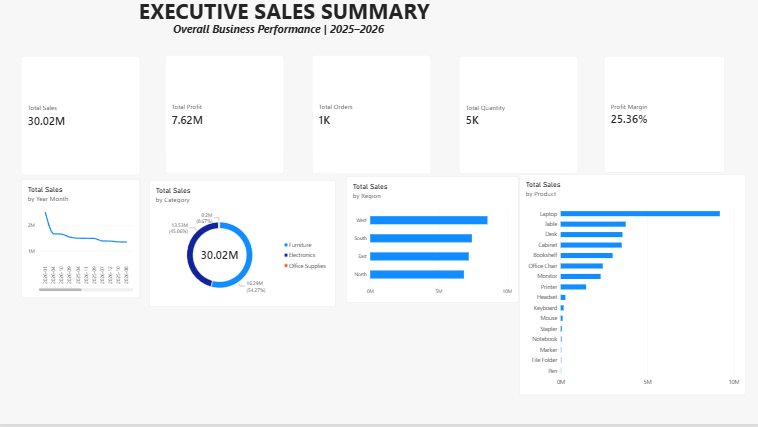
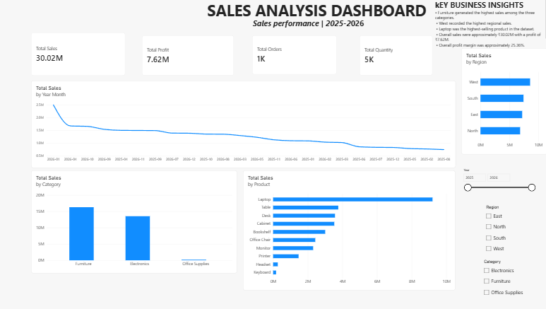
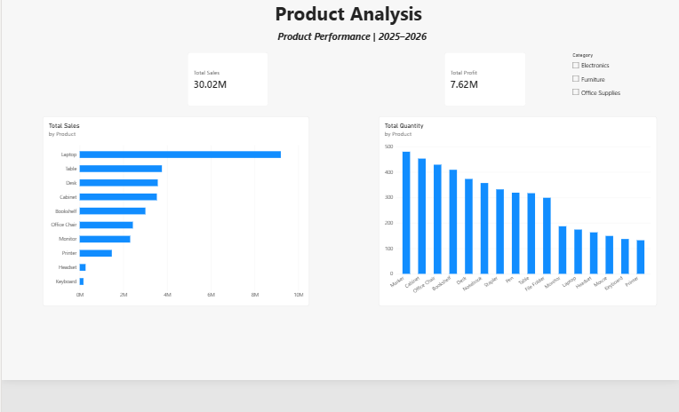
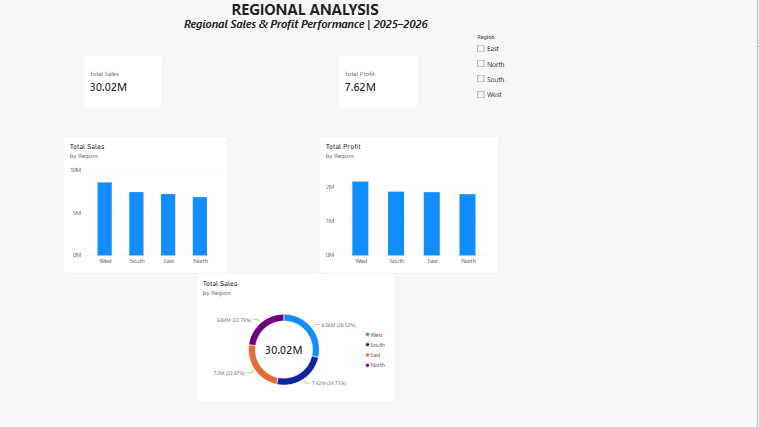

# Sales Dashboard – Power BI

## 📊 Project Overview

This project is an interactive Sales Dashboard developed using Microsoft Power BI to analyze sales performance and generate useful business insights.

## 🛠️ Tools & Technologies

- Microsoft Power BI
- Power Query
- DAX
- Data Visualization

## 📈 Dashboard Features

- Sales performance analysis
- Interactive charts and visualizations
- KPI tracking
- Category and product analysis
- Business performance insights
- Interactive filtering and drill-down analysis

## 📂 Project Files

- `Sales Analysis.pbix` – Power BI dashboard file

## 💡 Key Insights

The dashboard helps users understand sales trends, identify high-performing areas, and analyze business performance through interactive visualizations.

## 🚀 How to Use

1. Download `Sales Analysis.pbix`.
2. Open the file using Microsoft Power BI Desktop.
3. Explore the dashboard using the available filters and visualizations.

## 👤 Author

**Hariharan**

---

⭐ If you find this project useful, feel free to explore the repository.
## 📸 Dashboard Preview
📊 Project Highlights

KPI| Value
Total Sales| 30.02M
Total Profit| 7.62M
Total Orders| 1K
Total Quantity| 5K
Profit Margin| 25.36%

The dashboard provides an interactive view of sales performance across products, regions, and time periods.

### Executive Sales Summary

### Sales Analysis Dashboard

### Product Analysis

### Regional Analysis

## ⭐ Project Highlights

- Built an interactive Sales Dashboard using Power BI
- Analyzed overall sales, products, and regional performance
- Created KPI cards and interactive visualizations
- Used data analysis to identify key business insights
- Added dashboard screenshots for easy project preview

  📊 Project Features

- Executive Sales Summary – Overall sales and business performance
- Product Analysis – Sales performance across different products
- Regional Analysis – Comparison of sales across regions
- Interactive Dashboard – Power BI visuals and KPIs for business insights
- Data Visualization – Charts and graphs to make trends easy to understand

🛠️ Tools & Technologies

- Power BI
- DAX
- Data Visualization
- Data Analysis
- Microsoft Excel
